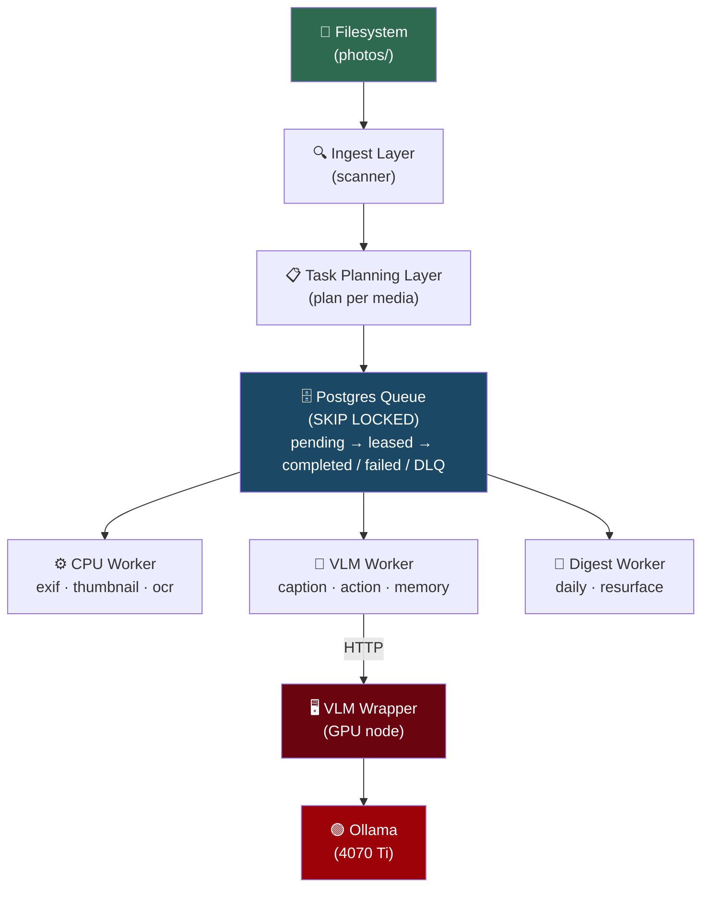

# Photo Intelligence & Digest System

> Self-hosted, extensible photo-processing pipeline — ingest images from the
> filesystem, extract structured information via OCR and Vision LLMs, and
> produce daily digests.

## Architecture



## Quick Start

```bash
# Setup
cp .env.example .env
# Edit .env: set PHOTO_DATA_DIR, VLM_WRAPPER_URL (GPU node IP)

# Start database
docker compose up -d postgres
psql -h localhost -U photo_intel -d photo_intel -f migrations/001_initial_schema.sql

# GPU node (separate machine with 4070 Ti)
docker compose -f docker-compose-gpu.yml up -d

# Ingest photos
photo-intel ingest --dirs /path/to/photos

# Start workers
photo-intel worker --type cpu &
photo-intel worker --type vlm &
photo-intel worker --type maintenance &

# API
photo-intel api
# → http://localhost:8000/docs (Swagger UI)
# → http://localhost:8000/stats
```

## Project Structure

```
photo-intel/
├── src/
│   ├── api/              # FastAPI admin API
│   │   └── app.py
│   ├── config/           # Settings (env + YAML)
│   │   └── settings.py
│   ├── digest/           # Digest generation
│   │   └── generator.py
│   ├── ingest/           # Filesystem scanning
│   │   └── scanner.py
│   ├── models/           # SQLAlchemy ORM models
│   │   ├── database.py
│   │   └── tables.py
│   ├── queue/            # Postgres-backed task queue
│   │   └── postgres_queue.py
│   ├── tasks/            # Task system
│   │   ├── __init__.py   # TaskHandler protocol
│   │   ├── registry.py   # Task registry
│   │   ├── planner.py    # Task planner
│   │   └── handlers/     # Task implementations
│   │       ├── exif_handler.py
│   │       ├── thumbnail_handler.py
│   │       ├── ocr_handler.py
│   │       └── vlm_handler.py
│   ├── vlm_wrapper/      # VLM Wrapper (GPU node service)
│   │   └── app.py
│   ├── workers/          # Worker loop
│   │   └── worker_loop.py
│   ├── utils/            # Logging, helpers
│   └── cli.py            # CLI entry point
├── migrations/           # SQL schema
├── prompts/              # VLM prompt definitions (YAML)
├── tests/                # Test suite
├── docs/                 # Architecture, API spec, MVP plan
├── docker/               # Dockerfiles
├── docker-compose.yml    # Main services
├── docker-compose-gpu.yml # GPU node services
└── pyproject.toml
```

## Task Types

| Task | Runs On | Input | Output |
|------|---------|-------|--------|
| `extract_exif` | CPU | photo | EXIF JSON, GPS, camera info |
| `generate_thumbnail` | CPU | photo/screenshot | WebP thumbnails (256, 512) |
| `ocr_full` | CPU | screenshot | Full text, blocks, confidence |
| `ocr_entities` | CPU | screenshot (after OCR) | Dates, URLs, prices, emails |
| `vlm_caption` | GPU | photo/screenshot | Caption, scene category, subjects |
| `vlm_actionability` | GPU | screenshot | Action items, urgency, category |
| `vlm_memory_summary` | GPU | photo/screenshot | Memory relevance, people/place hints |

## API Endpoints

| Method | Path | Description |
|--------|------|-------------|
| `GET` | `/health` | Health check |
| `GET` | `/stats` | System statistics |
| `POST` | `/ingest/scan` | Trigger batch scan |
| `GET` | `/media` | List media items |
| `GET` | `/media/{id}` | Media detail + task outputs |
| `GET` | `/tasks/definitions` | List task definitions |
| `POST` | `/tasks/replan/{id}` | Replan tasks for media |
| `GET` | `/dlq` | Dead letter queue |
| `POST` | `/dlq/retry/{id}` | Retry DLQ task |
| `GET` | `/metrics/processing` | Processing metrics |

## Adding a New Task Type

1. Create handler in `src/tasks/handlers/my_task.py`:
   ```python
   from src.tasks.registry import register_task

   @register_task
   class MyTaskHandler:
       task_type = "my_custom_task"

       def compute_input_hash(self, media_item_id, config):
           ...

       async def execute(self, media_item_id, task_config, input_hash, session):
           ...
           return {"result": "..."}
   ```

2. Import in `src/tasks/handlers/__init__.py`

3. Add task_definition in DB:
   ```sql
   INSERT INTO task_definition (task_type, version, config_json, priority, prerequisites)
   VALUES ('my_custom_task', 1, '{}'::jsonb, 80, '["extract_exif"]'::jsonb);
   ```

4. For VLM tasks, add prompt in VLM Wrapper's `PROMPT_REGISTRY`

## Design Principles

| Principle | Detail |
|-----------|--------|
| **Idempotent** | Each task identified by `(media_id, type, version, input_hash)` |
| **Decoupled** | Tasks never call each other; communicate via queue + DB |
| **Resumable** | Crash recovery via lease expiry; no work lost |
| **Extensible** | New tasks = new handler + DB row |
| **GPU-tolerant** | VLM worker gracefully reschedules when GPU unavailable |
