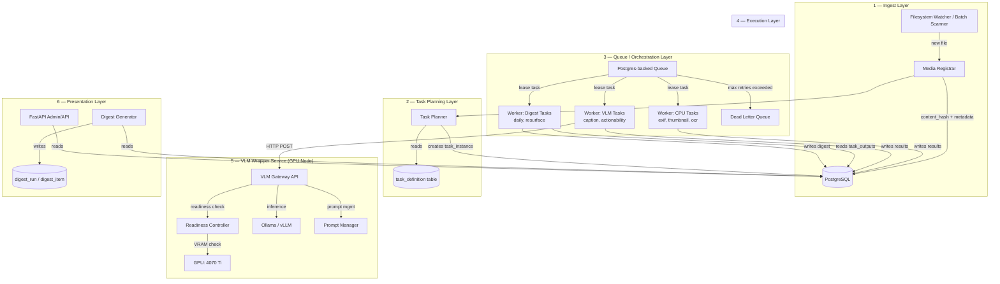
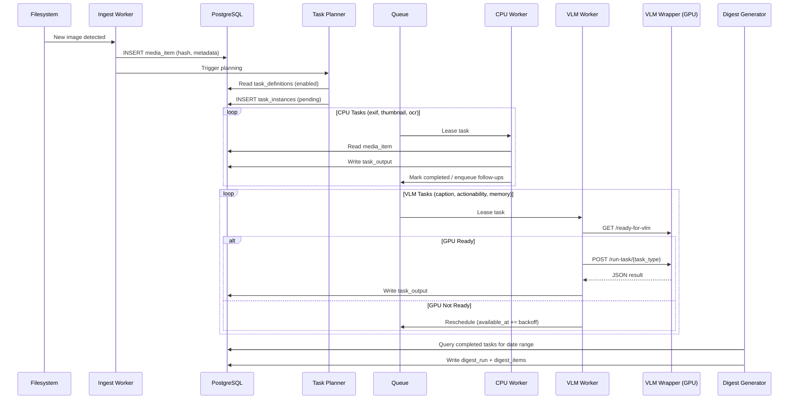
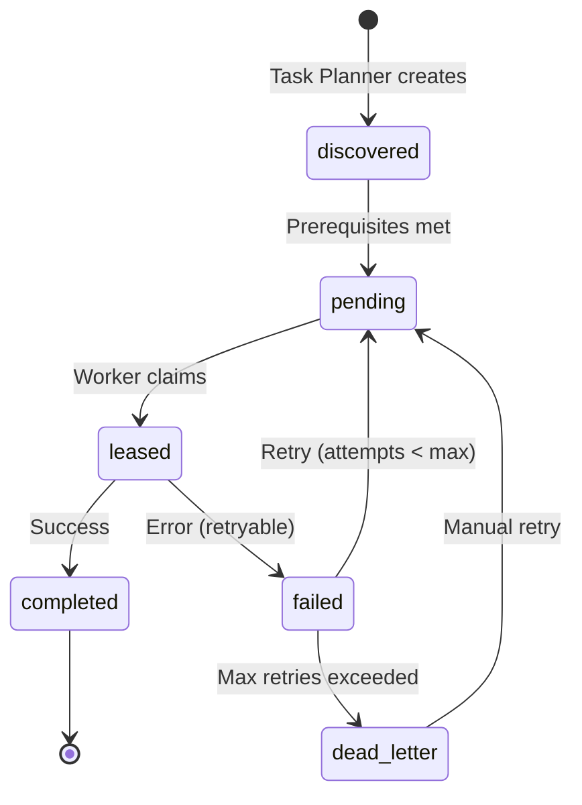

# Photo Intelligence & Digest System — Architecture

## Overview

A self-hosted, extensible photo processing pipeline that ingests images,
extracts structured information via OCR and Vision LLMs, and produces daily digests.

## Architecture Diagram

## Component Flow (Sequence)

## Task State Machine

## Layer Responsibilities

### 1. Ingest Layer
- Watches configured directories (inotify / polling)
- Computes SHA-256 content hash for deduplication
- Extracts basic file metadata (size, MIME type, timestamps)
- Classifies media_kind (photo vs screenshot) via heuristics
- Registers `media_item` in database
- Triggers Task Planner for new items
- **Does NOT perform heavy processing**

### 2. Task Planning Layer
- Reads `task_definition` table for enabled tasks
- Evaluates prerequisite conditions per task type
- Creates `task_instance` records with proper priority
- Computes `input_hash` for idempotency
- Handles task versioning (re-plans if version changes)

### 3. Queue / Orchestration Layer
- Postgres-based queue with `SELECT ... FOR UPDATE SKIP LOCKED`
- Supports: leasing, retries with exponential backoff, scheduling
- Dead Letter Queue for permanently failed tasks
- Future: RabbitMQ adapter with dead-letter exchange

### 4. Execution Layer
- Workers are typed (cpu, vlm, digest)
- Each worker: lease → execute → write output → ack/nack
- Tasks read inputs from DB, write outputs to DB
- Tasks may enqueue follow-up tasks (never call directly)
- GPU unavailability = graceful reschedule, not failure

### 5. VLM Wrapper Service
- Runs on GPU node (4070 Ti)
- HTTP API wrapping Ollama/vLLM
- Readiness gating (VRAM, cooldown, manual override)
- Prompt management per task type
- Image preprocessing (resize, quality)
- Output validation against JSON schema

### 6. Presentation Layer
- Daily digest: summarizes today's processed images
- Resurface digest: surfaces older interesting content
- Future: search UI, admin dashboard, DLQ inspector

## Key Design Decisions

| Decision | Choice | Rationale |
|----------|--------|-----------|
| Queue backend | Postgres (initial) | No extra infra, SKIP LOCKED is robust |
| Task identity | (media_id, type, version, input_hash) | Ensures idempotency |
| VLM access | HTTP wrapper, not direct Ollama | Decoupling, readiness gating, caching |
| Worker types | Separate processes per type | Independent scaling, fault isolation |
| Config | Static (env/YAML) + Dynamic (DB) | Flexibility without restarts |
| Image processing | Per-task configurable | Screenshots vs photos need different handling |

## Networking

- All services communicate over LAN
- No public exposure required
- Future: Tailscale for cross-network access
- VLM Wrapper binds to LAN IP, authenticated via shared secret
